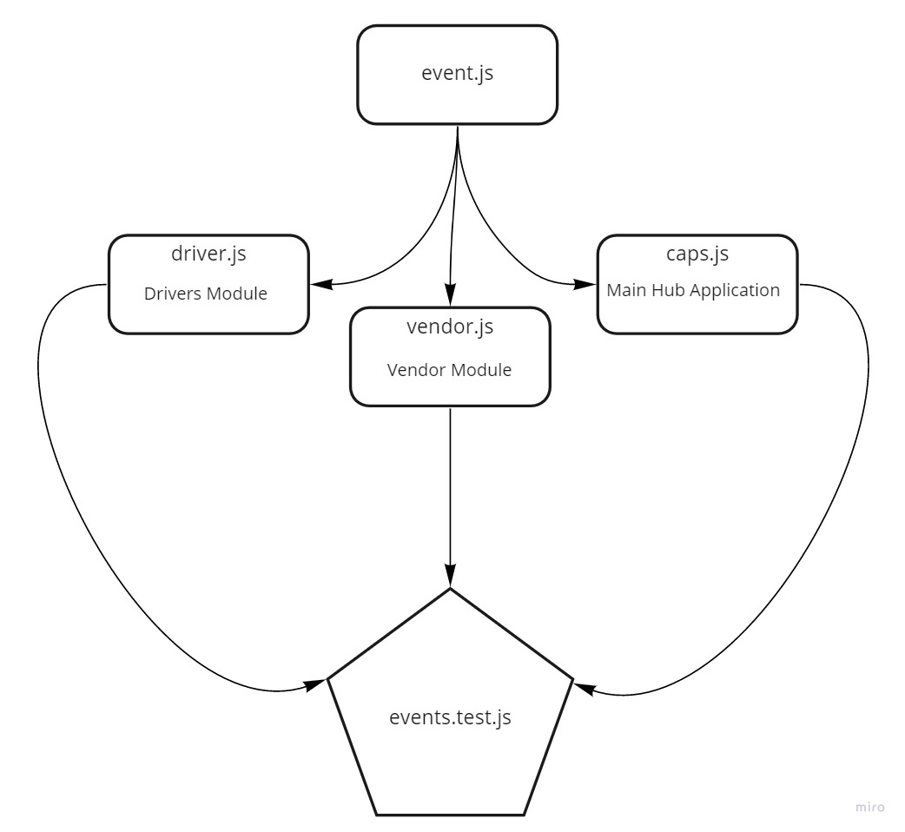

# CAPS: 

**CAPS:** Code Academy Parcel Service is a real-time service that allows for vendors, such as flower shops or restaurants, to alert a system of a package needing to be delivered, for drivers to instantly see what’s in their pickup queue, and then to alert the vendors as to the state of the deliveries (in transit, and then delivered).

**Author**: this repo is done by Aya Akrabawi

**Modules and Middlewares**
1- vendor.js 
2- driver.js
3- caps.js 
4- events.js

**UML:**
